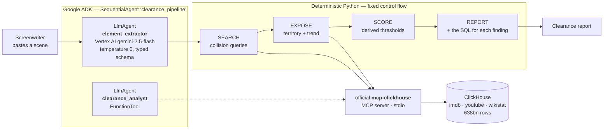
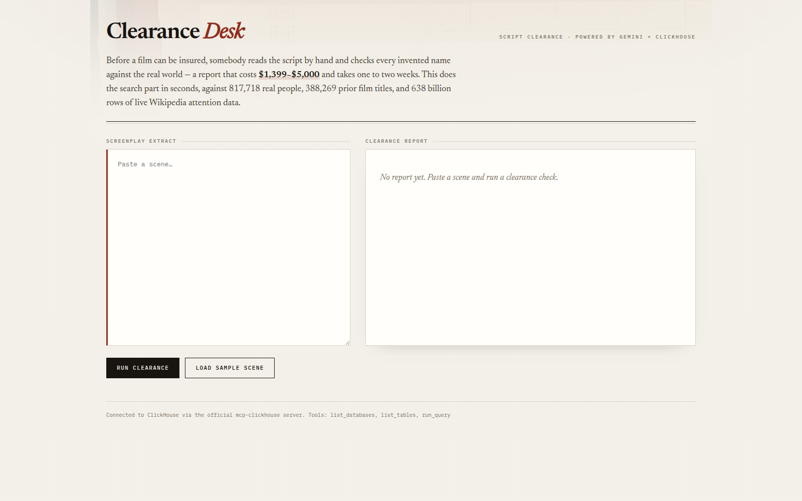
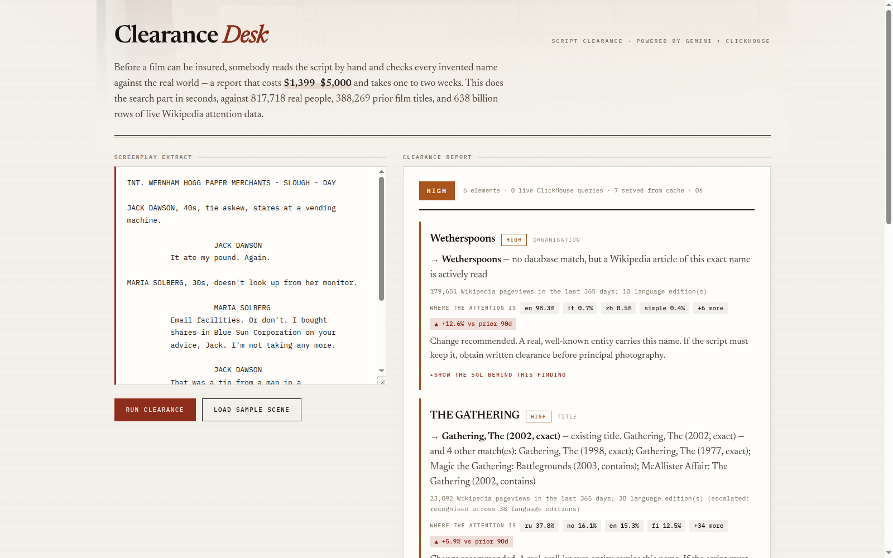
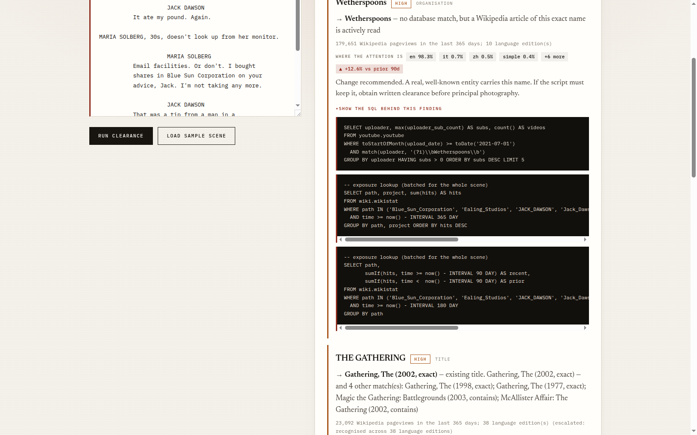

# Clearance Desk

**A script clearance agent for screenwriters and filmmakers, built on Google ADK, Gemini and ClickHouse.**

<br clear="left">

## Architecture



Two questions, two independent signals. **Existence** comes from historical film data;
**exposure** comes from Wikipedia attention measured over the last 365 days, updated daily.
Keeping them independent is what lets a 2008 snapshot still produce a risk score that
reflects today &mdash; and it is why a famous title missing from the title index is still
caught by the exposure signal.

Before a film can be insured, somebody reads the screenplay by hand and checks every invented
name against the real world. If a character, business or title collides with something real,
the production gets sued or the Errors & Omissions underwriter refuses to bind the policy.

That report costs **$1,399–$5,000 per feature** and takes **one to two weeks**, and it is done
by a human reading a script ([The Clearance Lab pricing](https://theclearancelab.com/)). When
clearance goes wrong it is not a rounding error: *Tarnation* was shot for $218 and ran up a
**$400,000** clearance bill; the *Ella Fitzgerald* documentary spent **60% of its budget** on it
([Center for Media & Social Impact](https://cmsimpact.org/)).

Clearance Desk does the **search half** of that report in seconds, and shows you the SQL behind
every finding so you can check it yourself.

---

## The idea: existence is not the same as exposure

A clearance report answers two different questions about every name in a script:

1. **Does something real already carry this name?**
2. **Is it prominent enough to notice, and to sue?**

Most name-matching answers only the first. Clearance Desk separates them:

| Question | Source | Scale |
|---|---|---|
| Existence — real people | `imdb.actors` ⋈ `imdb.roles` | 817,718 people |
| Existence — prior titles | `imdb.movies` | 388,269 films (partial — see Limits) |
| Existence — organisations | `youtube.youtube` | ~537M rows scanned |
| **Exposure — current attention** | **`wiki.wikistat`** | **638,111,114,033 rows, updated today** |

Exposure is not just a single number. The same table answers two questions no name-lookup can:

- **Where** the attention is, by language edition. `JACK DAWSON` is 46.6% Spanish and 37.4%
  Portuguese but only 14.6% English — so the name carries far more risk for a Latin American
  release than an Anglophone one.
- **Which way it is moving.** `JURASSIC PARK` attention is **+40.2%** over the last 90 days
  against the 90 before it. A name growing more famous is a name getting riskier to use.

Both come from one `GROUP BY` over 638 billion rows. That is the part of this that genuinely
needs ClickHouse rather than a conventional database.

`wiki.wikistat` is hourly Wikipedia pageviews per article per language edition. That is what
makes the risk score reflect *now* rather than the age of the snapshot: the collision set can be
historical, but the exposure that decides whether anyone objects is measured over the last 365
days, up to this morning.

It also produces the non-obvious results. `"Jack Dawson"` has no meaningful screen credits — but
32,061 Wikipedia pageviews across 12 languages, because it is the lead character in *Titanic*.
A famous *fictional* name is a clearance problem too, and the exposure signal catches it where a
person-database lookup does not.

---

## Architecture

A **deterministic, multi-step pipeline** — the control flow is ordinary Python, not an agent loop
that decides its own next move. The one step with model latitude runs at `temperature=0` against
a response schema, so the same script produces the same report.

```
 Google ADK  SequentialAgent "clearance_pipeline"
   ├── LlmAgent "element_extractor"   Gemini 2.5 Flash on Vertex AI, temperature 0,
   │                                  typed output_schema → clearable elements
   └── LlmAgent "clearance_analyst"   FunctionTool → official mcp-clickhouse server

 then, deterministic Python:
   SEARCH   collision queries  ─┐
   EXPOSE   territory + trend  ─┼─→ official mcp-clickhouse MCP server → ClickHouse
   SCORE    derived thresholds ─┘
   REPORT   findings + the SQL that produced each one
```

ADK's **workflow agents** are the right primitive for this brief: with a
`SequentialAgent` the control flow is fixed by the agent graph rather than decided by a
model at runtime, so only the reasoning *inside* each step is model-driven. That is what
makes the same screenplay produce the same clearance report. `/api/scan` drives step one
and hands off to deterministic Python for search, scoring and reporting.

`GET /api/health` reports the live MCP connection, its tools, and the ADK pipeline's
sub-agents, so the stack can be verified without reading the source.

### Why not a multi-agent system, and why no self-critique step

Both were deliberate, and both follow the 2026 evidence rather than the vibe:

- **No debate / multi-agent ensemble.** At equal token budgets, single-agent systems match or beat
  multi-agent on multi-hop reasoning, and debate agents converge to consensus rather than
  deliberating ([arXiv 2606.29425](https://arxiv.org/html/2606.29425)). Anthropic's own
  orchestrator-worker results come with a ~15× token cost
  ([Anthropic](https://www.anthropic.com/engineering/multi-agent-research-system)).
- **No self-review step.** Ungrounded self-critique measurably *hurts* — one study saw accuracy
  fall from 98% to 57%. Self-critique only helps when grounded in an external signal. So every
  check here is grounded in rows returned by ClickHouse, never in the model's opinion of its own
  output.

---

## The bug that would have made this lie to you

The public ClickHouse demo cluster is configured with:

```
max_rows_to_read   = 1000000000
read_overflow_mode = break        ← returns a PARTIAL answer with NO error
```

`break` means a query that exceeds the limit **stops reading and returns what it has, silently**.
Measured, on the 638-billion-row `wikistat` table:

| Query | Result | |
|---|---|---|
| `SELECT min(time), max(time), count()` — default | `count = 1,000,885,548`, `max(time) = 2026-07-25` | **wrong by 638×, no error raised** |
| same, `read_overflow_mode='throw'` | `Code: 158 ... TOO_MANY_ROWS` | fails loudly |
| bounded by sort key | `485,977 rows`, `max(time) = 2026-09-09 11:00` | correct |

Note the second-order damage: truncation corrupted the *date range* too, not just the count.

A clearance report that silently under-reports collisions is worse than no report, so every
statement carries `SETTINGS read_overflow_mode='throw'`, and truncation surfaces in the UI as a
visible warning instead of a quiet wrong number.

The related lesson is in `pipeline.py`: `youtube.youtube` is
`ORDER BY (toStartOfMonth(upload_date), uploader)`. Filtering on `toStartOfMonth(upload_date)`
prunes parts and reads ~537M rows; filtering on the raw `upload_date` column does **not** prune
and trips the limit. The sort-key form is load-bearing, not stylistic.

---

## Screenshots

| | |
|---|---|
|  |  |
| The brief, stated plainly | A clearance report: tier, exposure, territory, trend |


*Every finding carries the SQL that produced it — read it, re-run it, check the claim.*

## Repository layout

```
app/            FastAPI application
  clearance/    adk_agent · pipeline · mcp_client · score · cache · extract
  static/       single-page UI
samples/        example scenes
tests/          end-to-end functional sweep (25 checks)
docs/           screenshots
cache.json      warm cache, shipped so the demo survives the shared cluster quota
```

## Running it

```bash
git clone https://github.com/aswin-giridhar/clearance-desk && cd clearance-desk
python3 -m venv .venv && . .venv/bin/activate
pip install -r requirements.txt
gcloud auth application-default login
export GOOGLE_CLOUD_PROJECT=<your-project> GOOGLE_CLOUD_LOCATION=us-central1
uvicorn app.main:app --reload --port 8080
```

No ClickHouse credentials are needed: it connects to the public demo cluster
(`sql-clickhouse.clickhouse.com:8443`, user `demo`, empty password, read-only).

`GET /healthz` reports whether the MCP session came up and which tools it exposes.

## How Google Cloud and ClickHouse are used at runtime

| Requirement | Where |
|---|---|
| Google Cloud | **`google-adk`** `SequentialAgent`/`LlmAgent` → Vertex AI `gemini-2.5-flash` — `app/clearance/adk_agent.py`; `google-genai` types throughout |
| ClickHouse partner | official **`mcp-clickhouse`** MCP server over stdio, `run_query` tool — `app/clearance/mcp_client.py` |

## Limits — stated plainly

- IMDb tables are a snapshot ending **2008**, and the title table is **partial**: it holds
  388,269 films but omits some major ones (*Jurassic Park* and *The Godfather*'s 1972 entry are
  reachable only via the transposed form, and *Titanic* 1997 is absent entirely). Measured
  coverage of eight famous titles: **6 of 8**.
  Two consequences worth knowing:
  - Titles are stored with the leading article moved to the end — *The Godfather* is
    `"Godfather, The"`. Searching only the natural form silently misses exact matches, so both
    forms are queried.
  - The exposure signal is independent of this table, so a famous title the title index lacks is
    still caught: *Jurassic Park* scores CRITICAL on 2,273,657 pageviews despite no title match.
    That redundancy is deliberate.
- The organisation scan covers uploads from **2021-07-01** onward, ~537M of 4.56bn rows.
- Exposure is Wikipedia attention. An entity with no Wikipedia article scores zero even if it is
  commercially significant.
- **This is a search tool, not legal advice.** It narrows what a clearance lawyer must read. It
  does not replace one.

## Licence

Apache-2.0. See [LICENSE](LICENSE).
